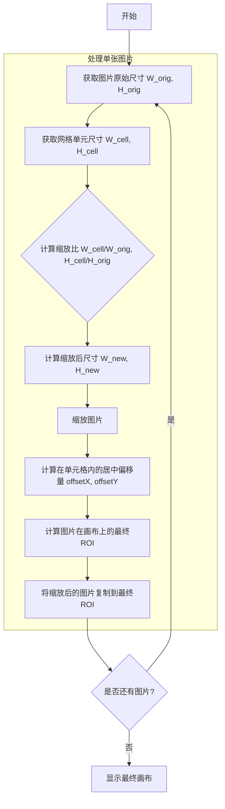

## 一、图像的读取与显示

核心功能是使用 `cv::imread()` 函数读取图像数据，并将其存储在一个 `cv::Mat` 对象中，然后通过 `cv::imshow()` 函数将图像显示在窗口中。

```cpp
#include <iostream>
#include <opencv2/opencv.hpp>
#include <string>

int main() {
    // 1. 指定图像路径
    // 注意：在Windows上，路径分隔符应使用正斜杠 "/" 或双反斜杠 "\\"
    const std::string image_path = "D:/path/to/your/image.jpg";

    // 2. 读取图像到 cv::Mat 对象
    // cv::imread(路径, 读取模式);
    cv::Mat image = cv::imread(image_path, cv::IMREAD_COLOR);

    // 3. 检查图像是否成功加载
    if (image.empty()) {
        std::cerr << "Could not open or find the image at: " << image_path << std::endl;
        return -1;
    }

    // 4. 显示图像
    // cv::imshow("窗口标题", 图像矩阵);
    cv::imshow("Image Display", image);

    // 5. 等待按键
    // cv::waitKey(0); // 等待无限久，直到有按键操作
    cv::waitKey(3000); // 等待3000毫秒（3秒）后自动关闭窗口

    return 0;
}
```

### `cv::imread()` 函数

用于从指定文件加载图像。

  - **原型**: `cv::Mat cv::imread(const std::string& filename, int flags = IMREAD_COLOR)`
  - **参数**:
      - `filename`: 图像文件的完整路径。
      - `flags`: 读取模式，用于指定加载图像的颜色类型。

| 读取模式 (`flags`)         | 说明                                       |
| -------------------------- | ------------------------------------------ |
| `cv::IMREAD_COLOR`         | 加载彩色图像（BGR顺序），忽略Alpha通道。这是默认值。 |
| `cv::IMREAD_GRAYSCALE`     | 以灰度模式加载图像。                       |
| `cv::IMREAD_UNCHANGED`     | 按原样加载图像，包括Alpha通道（如果存在）。  |

## 二、写入与保存图片

使用 `cv::imwrite()` 函数可以将 `cv::Mat` 对象中的图像数据保存为文件。该函数可以根据文件扩展名（如 `.jpg`, `.png`）自动选择编码器。

### 1\. 常规保存

```cpp
#include <iostream>
#include <opencv2/opencv.hpp>
#include <string>

int main() {
    const std::string image_path = "D:/path/to/your/image.png";
    const std::string output_path = "D:/path/to/output_image.jpg";

    cv::Mat image = cv::imread(image_path, cv::IMREAD_COLOR);

    if (image.empty()) {
        std::cerr << "Could not read the image." << std::endl;
        return -1;
    }

    // cv::imwrite(输出路径, 图像矩阵);
    bool isSuccess = cv::imwrite(output_path, image);

    if (isSuccess) {
        std::cout << "Image saved successfully to " << output_path << std::endl;
    } else {
        std::cerr << "Failed to save the image." << std::endl;
    }
    
    return 0;
}
```

### 2\. 保存时设置特定参数

`cv::imwrite()` 的第三个参数 `params` 允许为特定图像格式设置保存选项，例如JPEG的质量或PNG的压缩级别。该参数是一个 `std::vector<int>` 类型的容器，其中参数成对出现：`{参数标识符, 参数值}`。

```cpp
#include <iostream>
#include <vector>
#include <opencv2/opencv.hpp>

int main() {
    // ... (加载图像代码同上) ...
    cv::Mat image = cv::imread("D:/path/to/your/image.png");
    if (image.empty()) return -1;
    
    const std::string output_path_png = "D:/path/to/output_compressed.png";

    // 设置PNG压缩级别为9（0-9，9为最高压缩）
    std::vector<int> png_params;
    png_params.push_back(cv::IMWRITE_PNG_COMPRESSION);
    png_params.push_back(9);

    // 或者直接初始化
    // std::vector<int> png_params = {cv::IMWRITE_PNG_COMPRESSION, 9};

    bool isSuccess = cv::imwrite(output_path_png, image, png_params);

    if (isSuccess) {
        std::cout << "PNG with high compression saved successfully." << std::endl;
    } else {
        std::cerr << "Failed to save the compressed PNG." << std::endl;
    }

    return 0;
}
```

### `ImwriteFlags` 常用参数

| 参数标识符                      | 格式 | 值范围      | 描述                                     |
| ------------------------------- | ---- | ----------- | ---------------------------------------- |
| `IMWRITE_JPEG_QUALITY`          | JPEG | 0 - 100     | 设置JPEG质量，值越高图像质量越好，文件越大。默认值为95。 |
| `IMWRITE_PNG_COMPRESSION`       | PNG  | 0 - 9       | 设置PNG压缩级别，值越高文件越小，但压缩时间越长。默认值为1（最快速度）。 |
| `IMWRITE_PNG_STRATEGY`          | PNG  | 枚举值      | 设置PNG压缩策略，如`IMWRITE_PNG_STRATEGY_RLE`。 |
| `IMWRITE_WEBP_QUALITY`          | WebP | 1 - 100     | 设置WebP质量，100为无损。默认值为101（无损）。 |

## 三、创建与管理窗口

OpenCV允许自动或手动创建窗口来显示图像。

### 1\. 自动创建窗口

调用 `cv::imshow()` 时，如果指定名称的窗口不存在，它会自动创建一个。这种窗口的大小会根据显示的图像自动调整，用户无法手动拖拽改变。

```cpp
cv::imshow("Auto Window", image); // 如果名为 "Auto Window" 的窗口不存在，则自动创建
cv::waitKey(0);
```

### 2\. 手动创建窗口

使用 `cv::namedWindow()` 可以预先创建一个窗口，并指定其属性（如是否可调整大小）。之后 `cv::imshow()` 使用相同的窗口名称时，会将图像显示在该已创建的窗口中。

  - **`cv::namedWindow()`**: 创建一个窗口。
  - **`cv::resizeWindow()`**: 调整窗口大小。

```cpp
// 1. 手动创建一个可调整大小的窗口
cv::namedWindow("Manual Window", cv::WINDOW_NORMAL); 

// 2. 在该窗口中显示图像
cv::imshow("Manual Window", image); 

// 3. 调整窗口大小
cv::resizeWindow("Manual Window", 800, 600);
// 或者使用 cv::Size 对象
// cv::Size new_size(800, 600);
// cv::resizeWindow("Manual Window", new_size);

cv::waitKey(0);
```

### `WindowFlags` 窗口属性标志

| 标志 (`flags`)        | 说明                                             |
| --------------------- | ------------------------------------------------ |
| `WINDOW_NORMAL`       | 用户可以手动拖拽调整窗口大小。                   |
| `WINDOW_AUTOSIZE`     | 窗口大小根据图像自动调整，用户无法更改。这是默认值。 |
| `WINDOW_FULLSCREEN`   | 以全屏模式显示窗口。                             |
| `WINDOW_KEEPRATIO`    | 调整窗口大小时，图像保持原始宽高比。             |
| `WINDOW_FREERATIO`    | 调整窗口大小时，图像填充整个窗口，不保持宽高比。 |

## 四、在一个窗口中显示多张图片

要在一个窗口中以网格形式显示多张图片，并且保持每张图片的原始宽高比，核心思路是：

1.  创建一个足够大的空白画布（`cv::Mat`）。
2.  计算网格的行数和列数。
3.  遍历每张待显示的图片。
4.  对于每张图片，计算一个缩放比例，使其能完整地放入网格单元格内。
5.  将图片按此比例缩放。
6.  计算缩放后图片在单元格内居中的位置。
7.  将缩放后的图片复制到画布的正确位置上。

### 逻辑流程图



### 示例代码

```cpp
#include <iostream>
#include <vector>
#include <string>
#include <cmath>
#include <algorithm>
#include <opencv2/opencv.hpp>

/**
 * @brief 在一个网格中显示多张图片，并保持每张图片的原始宽高比。
 * @param images 待显示的cv::Mat图片向量。
 * @param windowName 显示窗口的标题。
 * @param cell_size 网格中每个单元格的尺寸。
 */
void showImagesInGrid(const std::vector<cv::Mat>& images,
                      const std::string& windowName = "Image Grid",
                      const cv::Size& cell_size = cv::Size(400, 300)) {
    if (images.empty()) return;

    // 计算网格布局
    const int imageCount = images.size();
    int cols = static_cast<int>(std::ceil(std::sqrt(imageCount)));
    int rows = static_cast<int>(std::ceil(static_cast<double>(imageCount) / cols));

    // 创建大画布
    cv::Mat canvas(rows * cell_size.height, cols * cell_size.width, CV_8UC3, cv::Scalar(20, 20, 20));

    for (int i = 0; i < imageCount; ++i) {
        const cv::Mat& originalImage = images[i];
        if (originalImage.empty()) continue;

        // 1. 计算保持宽高比的缩放比例
        double scale = std::min(
            static_cast<double>(cell_size.width) / originalImage.cols,
            static_cast<double>(cell_size.height) / originalImage.rows
        );

        // 2. 缩放图片
        cv::Size newSize(static_cast<int>(originalImage.cols * scale), static_cast<int>(originalImage.rows * scale));
        cv::Mat resizedImage;
        cv::resize(originalImage, resizedImage, newSize, 0, 0, cv::INTER_AREA);

        // 3. 计算图片在画布上的目标位置 (ROI)
        int cell_col = i % cols;
        int cell_row = i / cols;
        int cell_X = cell_col * cell_size.width;
        int cell_Y = cell_row * cell_size.height;
        int offsetX = (cell_size.width - newSize.width) / 2;
        int offsetY = (cell_size.height - newSize.height) / 2;
        cv::Rect targetRoi(cell_X + offsetX, cell_Y + offsetY, newSize.width, newSize.height);

        // 4. 将缩放后的图片复制到画布
        resizedImage.copyTo(canvas(targetRoi));
    }

    cv::imshow(windowName, canvas);
}

int main() {
    // 假设已加载多张图片到 std::vector<cv::Mat> srcImages;
    std::vector<std::string> imagePaths = {
        "D:/path/to/image1.jpg",
        "D:/path/to/image2.png",
        "D:/path/to/image3.jpg",
        "D:/path/to/image4.png"
    };

    std::vector<cv::Mat> srcImages;
    for (const auto& path : imagePaths) {
        cv::Mat img = cv::imread(path);
        if (!img.empty()) {
            srcImages.push_back(img);
        }
    }

    if (srcImages.empty()) {
        std::cerr << "Error: No images were loaded." << std::endl;
        return -1;
    }

    showImagesInGrid(srcImages);
    cv::waitKey(0);

    return 0;
}
```

